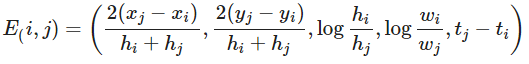
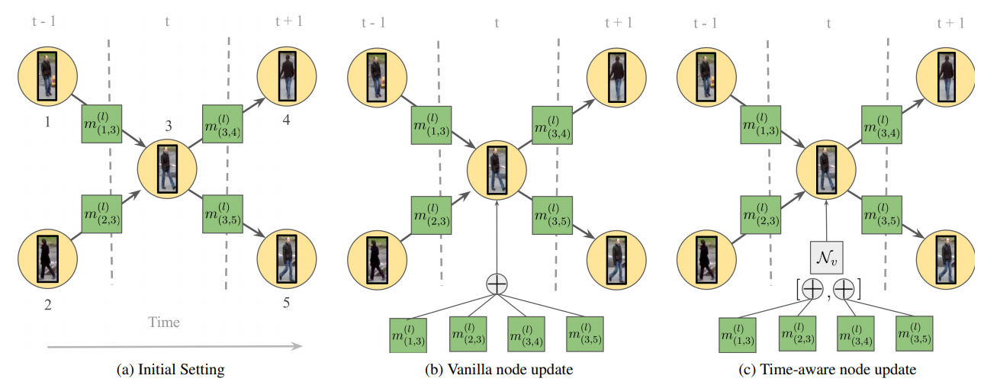

# Multiple Object Tracking using ReID-Embedding and Message Passing Neural Network

In this repo, I build a ReID-based tracker that combine both apperance and position information with a Message Passing Neural Network, inspired by the approach presented in [Learning a Neural Solver for Multiple Object Tracking](https://arxiv.org/abs/1912.07515). 

In Message Passing Neural Network, the node features are ReID embeddings, and the 5-dimensional edge features are as followed: 

It is noticeable that in the edge-to-node update, I use the time-aware message passing proposed in [Learning a Neural Solver for Multiple Object Tracking](https://arxiv.org/abs/1912.07515). 

The dataset used in this experiment is [MOT16](https://motchallenge.net/data/MOT16/), which is a benchmark that focus on the pedestrian tracking in the crowded scenes.

The dataset is splitted as followed, as I use leave-one-out cross validation in this experiment.

| Training & Validation Set | Test Set  |
| :-------------:           | :-------: |
| MOT16 - 2                 | MOT16 - 1 |
| MOT16 - 4                 | MOT16 - 8 |
| MOT16 - 5                 | MOT16 - 12|
| MOT16 - 9                 |           |
| MOT16 - 10                |           |
| MOT16 - 11                |           |
| MOT16 - 13                |           |

The test result are as followed:

| Sequence | MOTA  | IDSW |
| :----:   |:-----:|:----:|
| MOT16-01 | 25.18 | 32   |
| MOT16-08 | 31.29 | 118  |
| MOT16-12 | 45.59 | 31   |
| OVERALL  | 33.82 | 181  |

Note: evaluation measures
| Measure | Description  |
| :----:   |:-----:|
| MOTA | Multiple object tracker accuracy. |
| IDSW | Identity Switches - Total number of track switches. |